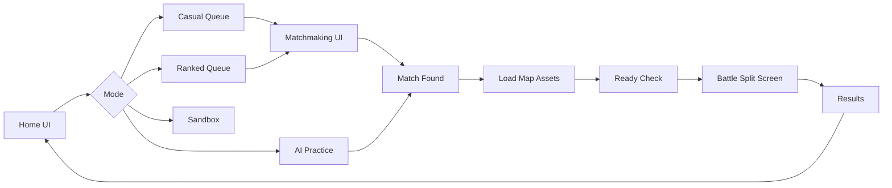

# Matchmaking & Game Flow

## Player Journey

## Matchmaking States

| State | Client UI | Server |
|-------|-----------|--------|
| `idle` | Home | — |
| `searching` | Timer + map votes | Queue bucket |
| `found` | Transition animation | Room created, JWT |
| `loading` | Progress bar | Wait `client.ready` |
| `playing` | Battle HUD | Event stream |
| `ended` | Win/Loss stats | Persist optional |

## Ranked Pairing Algorithm (v1)

1. Insert player into `{ mode: 'ranked', mmr, joinedAt, mapVotes }`.
2. Every 500ms, scan for pair with `|mmrA - mmrB| <= threshold`.
3. `threshold` starts at 150, +50 every 15s, cap 400.
4. On match: `match.found` → both join Socket.io room namespace.

## Event Timeline Example (first 30s)

| t | Event | Effect |
|---|-------|--------|
| 0 | `match.start` | seed, map neon_grid |
| 2 | `tower.build` mortar s2 | Player spends 120g |
| 8 | `enemy.send` scout lane0 | Income +2, spawn on opponent |
| 10 | `income.tick` | Both +income gold |
| 15 | `spell.cast` cryo | Slow cluster |
| 22 | `enemy.send` tanker lane1 | Pressure heavy lane |

## UI Screen Mapping

| Flow step | Asset |
|-----------|-------|
| Home | `UI/trangchu/code.html` |
| Queue | `UI/timdoithu/code.html` |
| Battle | `packages/client/index.html` + Phaser |
| Results | TBD Phase 3 |
